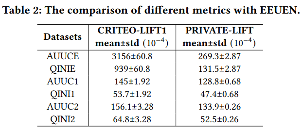

## Addressing Exposure Bias in Uplift Modeling forLarge-scale Online Advertising

广告和营销中存在的一个难题是如何真正有效和科学的衡量一次广告投放带来的真实增量效果，而这往往发生在广告发生曝光之后。

我们在我们的系统中部署应用了一套严格的RCT机制用于衡量这种真实的增量效果，并将日志和反馈用于我们模型的建模当中。在我们呈现的工作中，我们重点描述和推导了如何借助RCT机制和实际的数据来科学测算广告的真实曝光增量，并在模型的直接建模中，我们推算出对曝光增量建模的科学表达式和方案。

在这篇工作中，我们提出了一种通用范式，端到端的显式增量网络EUEN和针对真实曝光增量的显式曝光增量网络EEUEN，并在与当前声称先进的Uplift神经网络模型进行了充分对比，结果的显著提升验证了我们模型的简单高效。

工作中的模型在我们的实际工作中已经有了大规模的实际应用，我们会在后续的工作中予以呈现。

### 模型结构

1. EUEN网络设计

2. EEUEN网络设计


### 数据集

1. CRITEO-UPLIFT1，公开真实营销数据集，目标信号含treat, visit, conversion和exposure部分，[link](https://ailab.criteo.com/criteo-uplift-prediction-dataset/)
2. ALI-BRANDLIFT，阿里巴巴品牌Uplift真实实验数据采样，稀疏特征数据集，目标信号含treat, visit和exposure部分，[link](https://tianchi.aliyun.com/dataset/dataDetail?dataId=94883)

### 实验结果

1. 整体Uplift效果表现

2. 整体曝光Uplift效果表现

3. EEUEN曝光增量打分与乘积打分表现


### 运行环境与核心开源说明

实验基于公司自研的XDL框架进行，采用tensorflow-1.12作为backend，XDL开源项目参考[XDL编译安装](https://github.com/alibaba/x-deeplearning/wiki/%E7%BC%96%E8%AF%91%E5%AE%89%E8%A3%85)

本次开源仅承诺核心模型代码与逻辑的呈现，运行执行需要配置相应环境，或者抽取核心逻辑改造为本地tensorflow代码进行运行，我们会根据实际情况决定是否投入帮助进行本地化改造

### 模型运行参数
1. 运行公开数据集CRITEO-UPLIFT1的模型运行参数

2. 运行ALI-BRANDLIFT数据集的模型运行参数


### 论文引用
```
@inproceedings{ke2021addressing,
  title={Addressing Exposure Bias in Uplift Modeling for Large-scale Online Advertising},
  author={Ke, Wenwei and Liu, Chuanren and Shi, Xiangfu and Dai, Yiqiao and Philip, S Yu and Zhu, Xiaoqiang},
  booktitle={2021 IEEE International Conference on Data Mining (ICDM)},
  pages={1156--1161},
  year={2021},
  organization={IEEE}
}
```

如果引用本项目代码，请注明该地址

### 联系作者
如果有细节和其他方法的问题，可以通过issue提问，也可以通过论文作者邮箱进行咨询

### FAQ

### LICENSE

EEUEN使用[Apache-2.0](./LICENSE)许可
